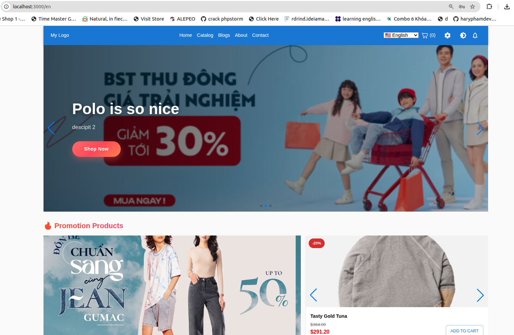
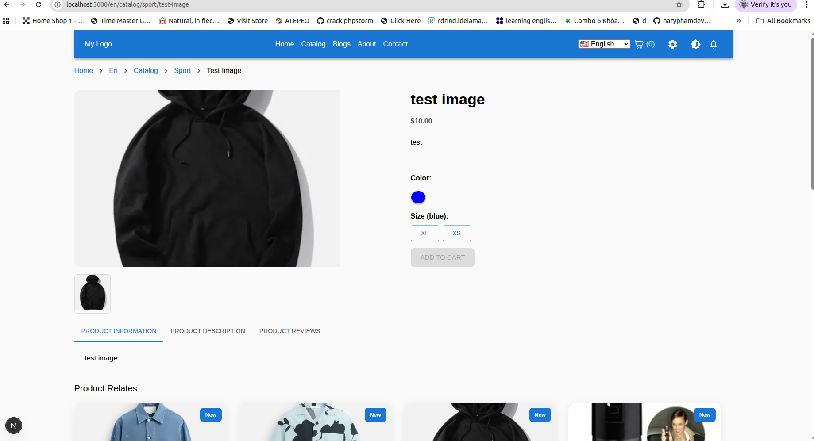
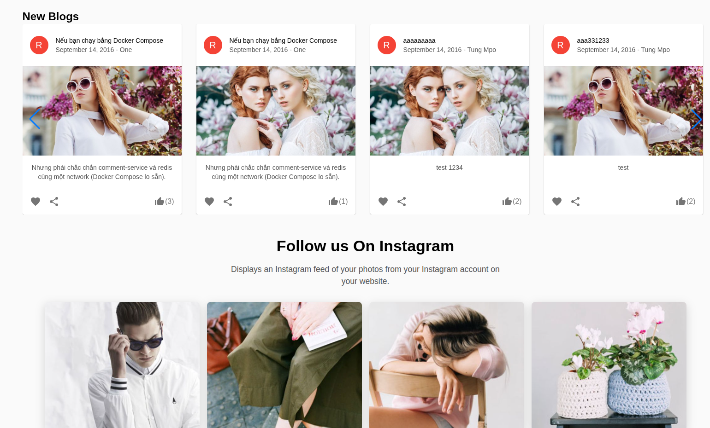
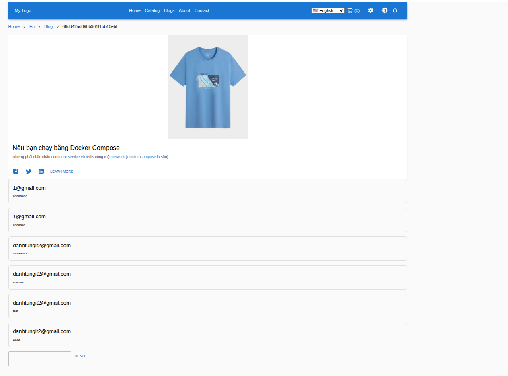
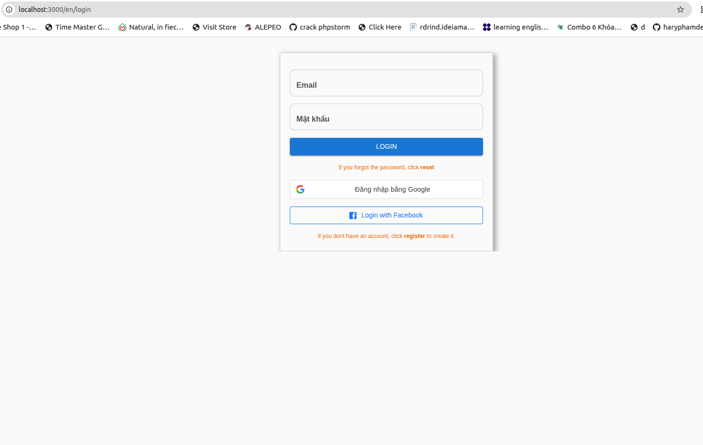
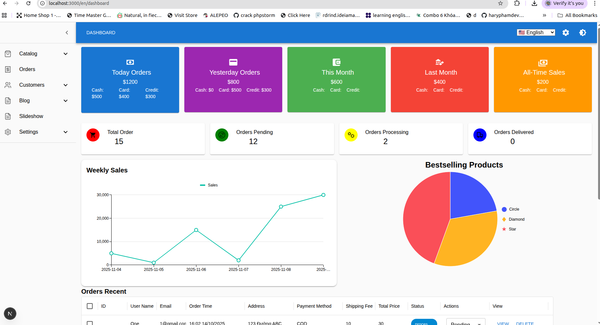

# E-Commerce & Blog Platform

> Full-featured E-commerce website with Blog system, real-time likes & comments using WebSocket. Built with **TypeScript**, **React**, **Node.js**, **MUI**, **Socket.io**, and **MongoDB**.

---

## 🚀 Live Demo / Deploy

### 🌐 Frontend (Next.js 15 + TypeScript)

https://nextjs15typescript.vercel.app/en

### 🛠️ Admin Dashboard

https://nextjs15typescript.vercel.app/en/dashboard

### 🔗 Backend API (Node.js + TypeScript)

https://nodejs2015typescript.onrender.com

## Table of Contents

- [Overview](#overview)
- [Features](#features)
- [Tech Stack](#tech-stack)
- [Setup & Run](#setup--run)
- [Production Docker Build & Run](#production-docker-build--run)
- [Docker (Dev Mode)](#docker-dev-mode)
- [Database & Environment Setup](#database--environment-setup)
- [Usage](#usage)
- [Screenshots](#screenshots)
- [Contributing](#contributing)
- [Contact](#contact)

---

## Overview

This project is a **full-stack E-commerce platform** integrated with a full Blog system. It supports real-time interactions using WebSocket.

### Purpose

- Provide a complete online shopping system.
- Offer a blog platform for better user engagement.
- Support real-time like + comment interactions.

---

## Features

### E-Commerce

- Product listing, filtering, categories
- Product detail page
- Shopping cart & checkout
- User authentication (signup/login)
- Forgot Password & Reset Password (email-based)
- Send email notifications
- Order management
- Admin Dashboard
  - Manage products
  - Manage orders
  - Manage users
  - Manage blog posts
  - Manage payments & shipping methods

### Blog

- Admin can create, edit, delete posts
- Users can view posts
- Real-time likes & comments (**Socket.io**)
- Nested comment replies
- Real-time notifications

### Other

- Responsive UI with **Material-UI (MUI)**
- JWT Authentication (Access + Refresh Tokens)
- Error handling & validations
- Full **TypeScript** support

---

## Tech Stack

- **Frontend:** React.js, MUI, TypeScript
- **Backend:** Node.js, Express.js, TypeScript, Socket.io
- **Database:** MongoDB (Atlas or local)
- **Authentication:** JWT
- **Dev Tools:** Docker, Git, VSCode
- **Deployment:** Docker, Vercel/Render/Heroku optional

---

## Setup & Run

Run locally without Docker:

```bash
# Clone the repo
git clone https://github.com/tung231195/nextjs15typescript.git
cd nextjs15typescript

# Backend setup
git https://github.com/tung231195/nodejs2015typescript.git
cd nodejs2015typescript
npm install
npm run dev

# Frontend setup
cd ../frontend
npm install
npm run dev
```

---

## Production Docker Build & Run

```bash
# Build images
docker-compose build

# Run containers
docker-compose up

# Detached mode
docker-compose up -d
```

Frontend → http://localhost:3000  
Backend → http://localhost:5000

---

## Docker (Dev Mode)

Enable hot reload for backend & frontend.

Run:

```bash
docker-compose -f docker-compose.dev.yml up --build
```

---

## Database & Environment Setup

Create a `.env` file inside **backend/**:

```
# App URLs
NEXT_PUBLIC_BASE_URL=http://localhost:3000
NEXT_PUBLIC_BASE_URL_NGOX=YOUR_NGROK_URL
NEXT_PUBLIC_BACKEND_URL=http://localhost:5000
NEXT_PUBLIC_SOCKET_URL=http://localhost:5000
NEXT_PUBLIC_SERVER_URL=http://localhost:5000/api

# OAuth Clients (Public but still obfuscate)
NEXT_PUBLIC_GOOGLE_CLIENT_ID=YOUR_GOOGLE_CLIENT_ID
NEXT_PUBLIC_FACEBOOK_CLIENT_ID=YOUR_FACEBOOK_APP_ID
NEXT_PUBLIC_FB_URL=https://www.facebook.com/v20.0/dialog/oauth

# Stripe (DO NOT SHARE)
STRIPE_WEBHOOK_SECRET=YOUR_STRIPE_WEBHOOK_SECRET
STRIPE_SECRET_KEY=YOUR_STRIPE_SECRET_KEY

# Axios
NEXT_PUBLIC_customAxios_URL=http://localhost:5000/api

# Docker
IS_DOKER=false

```

Optional: seed database

```bash
npm run seed
```

---

## Usage

- Open `http://localhost:3000`
- Register/login
- Reset password via email
- Browse products & checkout
- Interact with blog posts in real-time

---

## Screenshots

_(Optional, recommended)_

- Home page: 
- Product page: 
- Blogs: 
- Blog page with live comments: 
- Login flow: 
- Dashboard: 

---

## Contributing

- Fork the repo
- Create your feature branch
- Submit pull request

---

## Contact

**Kenny Danh**  
📧 Email: kennydanh11195@gmail.com
